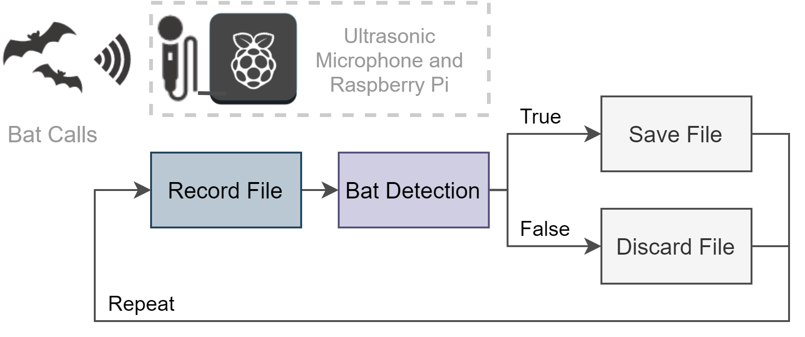
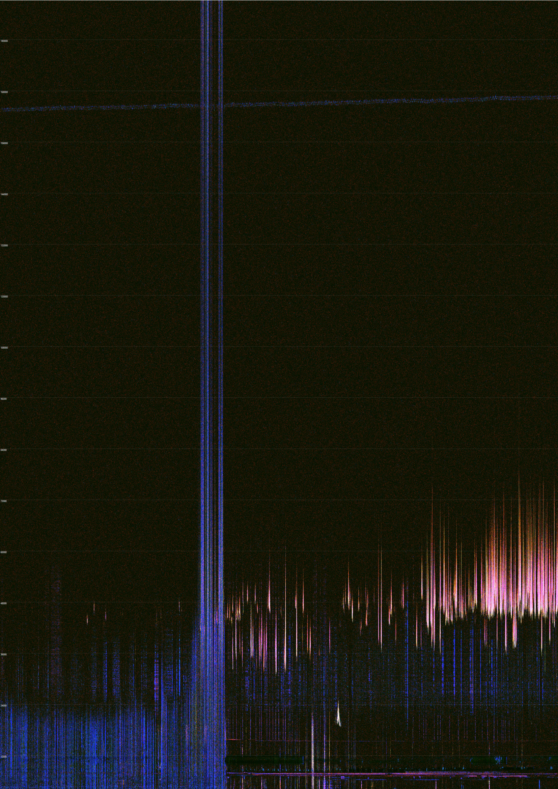
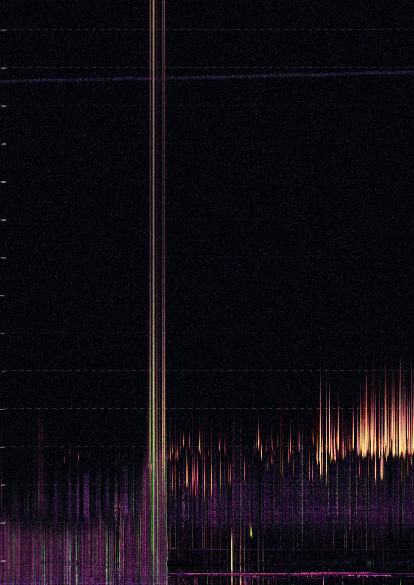

```{r setup, include=FALSE}
knitr::opts_chunk$set(echo = TRUE,fig.align='center')
library(seewave)
library(tuneR)
library(dplyr)
library(ggplot2)
library(reshape2)
library(stringr)
```

## Project overview

Currently biodiversity monitoring is expensive. There is a demand for a low cost, open source, light weight and flexible acoustic sensing network.Bioacoustics deal with single vocalisations of a species. For example, cane toads have a distinctive call that has been detected using the long-duration false-colour (LDFC) spectrograms [@roe2018catching]. Whereas Ecoacoustics create soundscapes of ecosystem processes. Our species of interest are small echolocating bats as they are vital for agricultural biodiversity and have a distinctive ultrasonic call. The QUT Ecoacoustics Research Group created analysis programs (AP) to produce spectral acoustic indices. A previous study used the acoustic indices to detect small echolocating bats. Approximately 54\% of bats were observable in the long-duration false-colour (LDFC) spectrograms [@towsey2018long]. Ultrasonic microphones are the most expensive element in an acoustic recording device. The previous studies were done with older technology but as the microphone technology improves and costs lower, a network of low cost sensors will be more achievable. High frequency microphones also pick up a lot of noise. Noise is bad for analysis as it overpowers any other sounds of interest. Therefore, there is also a demand for methods to remove and reduce noise. 

## Methods

A recording device was built with a Raspberry PI 3B and an ultrasonic microphone. The audio files were analysed in R, an open source software environment using the `seewave` and `tuneR` packages. The on-board detection algorithm was a basic thresholding model based on a mix of the acoustic indices and signal processing techniques. Thresholding is a simple, efficient and common bioacoustic classification technique [@gibb2019emerging]. 

Acoustic indices investigated include:

* Acoustic Complexity (ACI)
* Temporal Entropy (ENT)
* Event Count (EVN)
* Power minus Noise (PMN)
* Horizontal Ridge Count (RHZ)
* Vertical Ridge Count (RVT)

{width=85%}

<center>
Figure 1: Recording device workflow.
</center>

## Analysis Programs

The Analysis Programs (AP) can be run from within R, for example:

```{r pressure, eval=F}
## Where you want to store the results
output_directory <- normalizePath(file.path(base_output_directory, file_name))

## Make it into a real folder
dir.create(output_directory, recursive = TRUE)

## Command to feed into AnalysisPrograms.exe
command <- sprintf('audio2csv "%s" "C:\\AP\\ConfigFiles\\Towsey.Acoustic.yml" "%s" ',
                   file,
                   output_directory)

## Finally execute order 66
system2('C:\\AP\\AnalysisPrograms.exe', command)
```

My recordings are considered short so I needed to run the long duration false colour program separately to override the defaults.

```{r eval=F}
## Command to feed previous results into LDFC programs
command <- sprintf('DrawLongDurationSpectrograms -i "%s" -o "%s" -ip C:\\AP\\ConfigFiles\\IndexPropertiesConfig.yml -fcs C:\\AP\\ConfigFiles\\SpectrogramFalseColourConfigBotGar.yml',
                   paste0(output_directory, "\\Towsey.Acoustic"),
                   output_directory)

system2("C:\\AP\\AnalysisPrograms.exe", command)
```

So we get the resultant LDFC plots:

{width=50%}

<center>
Figure 2: ACI, ENT and EVN LDFC Plot.
</center>

{width=50%}

<center>
Figure 3: RVT, RHZ and PMN LDFC Plot.
</center>

## Using R 

First create the acoustic indices using the Analysis Programs.

```{r eval=F}
## Get full path to your working directory
base_wd <- gsub("/", "\\\\", getwd())

## Directory of wave files
directory <- "data"

## Directory for results
base_output_directory <- paste0(base_wd, "\\BatchIndicesOutput")

## Get full paths for all wave files
data_files <- paste0(base_wd, "\\", gsub(pattern = "/", replacement = "\\\\", list.files(directory, pattern = "*.wav", full.names = TRUE)))

## Path for first wave file (for example)
file <- data_files[1]

## Base name for first wave file
file_name <- basename(file)

## Make a folder for results
output_directory <- normalizePath(file.path(base_output_directory, file_name))

dir.create(output_directory, recursive = TRUE)

## Prepare command (full path)
command <- paste0(sprintf('audio2csv "%s" "C:\\AP\\ConfigFiles\\Towsey.Acoustic.BotGar.yml" "%s" ',
                          file,
                          output_directory))

## Finally, execute the command
system2('C:\\AP\\AnalysisPrograms.exe', command)

```

Now we can use the acoustic indices for visualisaiton, modelling and analysis.

```{r include=F, echo=F}
## Get full path to your working directory
base_wd <- gsub("/", "\\\\", getwd())

## Directory of wave files
directory <- "data"

## Directory for results
base_output_directory <- paste0(base_wd, "\\BatchIndicesOutput")

## Get full paths for all wave files
data_files <- paste0(base_wd, "\\", gsub(pattern = "/", replacement = "\\\\", list.files(directory, pattern = "*.wav", full.names = TRUE)))

## Path for first wave file (for example)
file <- data_files[1]

## Base name for first wave file
file_name <- basename(file)

clean_indices <- function(output_directory, file_name, ind){

  indices <- read.csv(paste0(output_directory, "\\Towsey.Acoustic\\", str_sub(file_name, end = -5),
                             "__Towsey.Acoustic.", ind, ".csv"))

  colnames(indices) <- c("Index", paste(ind, str_pad(seq(1, (ncol(indices)-1),1), width = 3, pad = "0"), sep ="_"))

  return(indices)
}

rescale <- function(x, scale){
  x/(max(x)/max(scale))
}

acoustic_features <- function(file, base_output_directory){

  # get just the name of the file
  file_name <- basename(file)

  # make a folder for results
  output_directory <- normalizePath(file.path(base_output_directory, file_name))

  ## Wave file features
  fwave <- readWave(file)
  sample_length <- length(fwave@left)/fwave@samp.rate
  sample_freq <- fwave@samp.rate

  all_indices <- c("ACI", "ENT", "BGN", "CVR", "DIF", "EVN", "PMN", "R3D", "RHZ",
                   "RNG", "RPS", "RVT", "SPT", "SUM")

  atable <- clean_indices(output_directory, file_name, all_indices[1]) %>%
    reshape::melt(id = "Index") %>%
    mutate(value = (value - mean(value))/(sqrt((var(value)))))

  for(ii in 2:length(all_indices)){

    atable <- clean_indices(output_directory, file_name, all_indices[ii]) %>%
      reshape::melt(id = "Index") %>%
      mutate(value = (value - mean(value))/(sqrt((var(value))))) %>%
      bind_rows(atable)

  }

  atable <- atable %>%
    mutate(type = substr(variable, 1, 3),
           Scale = as.numeric(substr(variable, 5, 7)),
           Index = rescale(Index, seq(0, sample_length, sample_length/40))) %>%
    mutate(Scale2 = Scale/(max(Scale)/sample_freq)/2e3)

  return(atable)
}
atable <- acoustic_features(file, base_output_directory)
```

```{r}
## Read in wave file 
fwave <- readWave(file)
sample_length <- length(fwave@left)/fwave@samp.rate
chosen_indices <- c("ACI", "ENT", "EVN", "PMN", "RHZ", "RVT")
```

```{r echo=F}
ggplot(dplyr::filter(atable, type %in% chosen_indices),
           aes(x = Index, y = Scale2, fill = value)) +
      geom_tile() +
      facet_wrap(vars(type)) +
      scale_fill_viridis_c() +
      scale_y_continuous(breaks = seq(0, 500, fwave@samp.rate/16e3)) +
      scale_x_continuous(breaks = seq(0, sample_length, round(sample_length/5, digits = 1))) +
      theme_bw() +
      xlab("Time (s)") +
      ylab("Frequency (kHz)")
```

There are so many other functions in R for signal processing. The possibilities are endless!

```{r}
## Mean spectrograms
fspec <- seewave::meanspec(fwave, f = fwave@samp.rate)

## find frequency peaks
fpks <- seewave::fpeaks(spec = fspec)
```


### Final notes:

* The recording device can successfully record at high frequencies.
* The accuracy of the classification cannot be verified due to the lack of expert annotated audio recordings.
* The current implementation of the recording device meets most of the original design requirements. 
* Analysis was difficult due to large noise interference (Raspberry Pi).
* **Future Work**: Improve recording device design by reducing power consumption, add remote and improve on-board processing. 

### References

