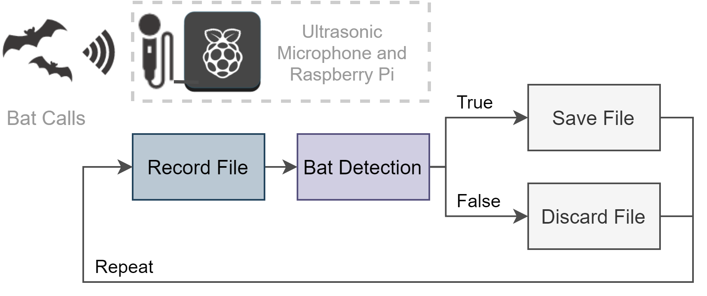
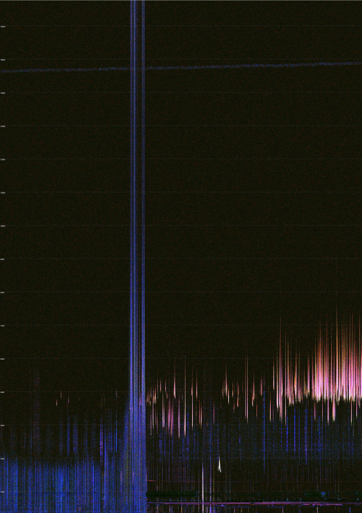
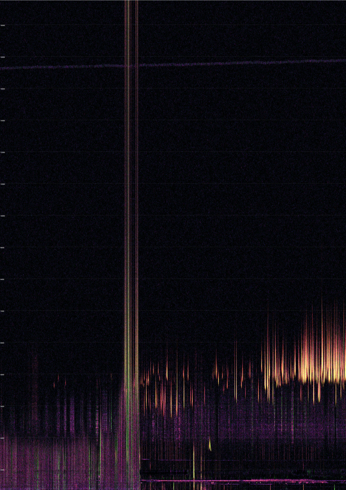
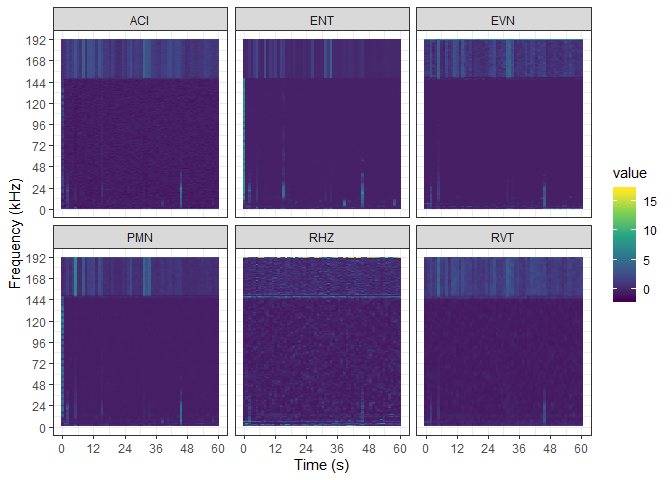
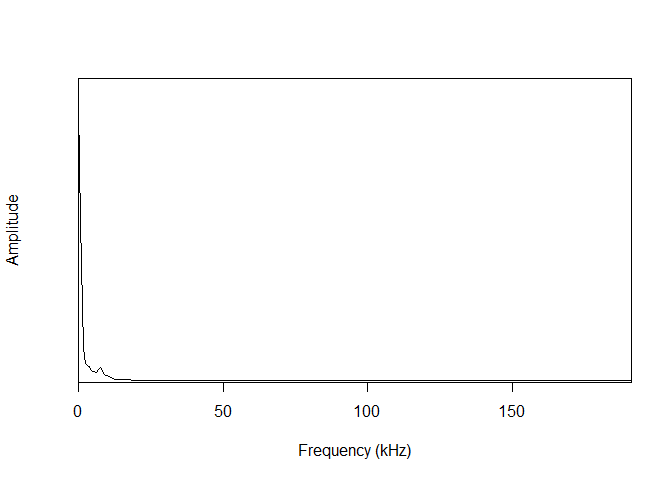
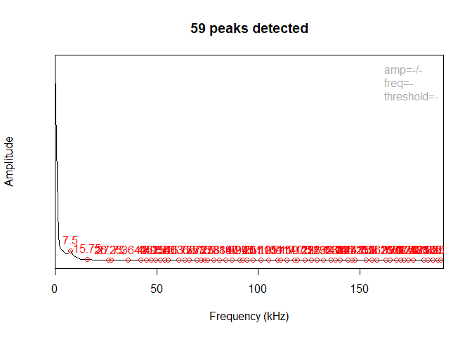

Acoustic indices for light weight detection of echolocating bat calls
================
Grace Heron
12 February 2020

-   [Project overview](#project-overview)
-   [Methods](#methods)
-   [Analysis Programs](#analysis-programs)
-   [Using R](#using-r)

Project overview
----------------

Currently biodiversity monitoring is expensive. There is a demand for a low cost, open source, light weight and flexible acoustic sensing network.Bioacoustics deal with single vocalisations of a species. For example, cane toads have a distinctive call that has been detected using the long-duration false-colour (LDFC) spectrograms (Roe et al. 2018). Whereas Ecoacoustics create soundscapes of ecosystem processes. Our species of interest are small echolocating bats as they are vital for agricultural biodiversity and have a distinctive ultrasonic call. The QUT Ecoacoustics Research Group created analysis programs (AP) to produce spectral acoustic indices. A previous study used the acoustic indices to detect small echolocating bats. Approximately 54% of bats were observable in the long-duration false-colour (LDFC) spectrograms (Towsey et al. 2018). Ultrasonic microphones are the most expensive element in an acoustic recording device. The previous studies were done with older technology but as the microphone technology improves and costs lower, a network of low cost sensors will be more achievable. High frequency microphones also pick up a lot of noise. Noise is bad for analysis as it overpowers any other sounds of interest. Therefore, there is also a demand for methods to remove and reduce noise.

Methods
-------

A recording device was built with a Raspberry PI 3B and an ultrasonic microphone. The audio files were analysed in R, an open source software environment using the `seewave` and `tuneR` packages. The on-board detection algorithm was a basic thresholding model based on a mix of the acoustic indices and signal processing techniques. Thresholding is a simple, efficient and common bioacoustic classification technique (Gibb et al. 2019).

Acoustic indices investigated include:

-   Acoustic Complexity (ACI)
-   Temporal Entropy (ENT)
-   Event Count (EVN)
-   Power minus Noise (PMN)
-   Horizontal Ridge Count (RHZ)
-   Vertical Ridge Count (RVT)



<center>
Figure 1: Recording device workflow.
</center>
Analysis Programs
-----------------

The Analysis Programs (AP) can be run from within R, for example:

``` r
## Where you want to store the results
output_directory <- normalizePath(file.path(base_output_directory, file_name))

## Make it into a real folder
dir.create(output_directory, recursive = TRUE)

## Command to feed into AnalysisPrograms.exe
command <- sprintf('audio2csv "%s" "C:\\AP\\ConfigFiles\\Towsey.Acoustic.yml" "%s" ',
                   file,
                   output_directory)

## Finally execute order 66
system2('C:\\AP\\AnalysisPrograms.exe', command)
```

My recordings are considered short so I needed to run the long duration false colour program separately to override the defaults.

``` r
## Command to feed previous results into LDFC programs
command <- sprintf('DrawLongDurationSpectrograms -i "%s" -o "%s" -ip C:\\AP\\ConfigFiles\\IndexPropertiesConfig.yml -fcs C:\\AP\\ConfigFiles\\SpectrogramFalseColourConfigBotGar.yml',
                   paste0(output_directory, "\\Towsey.Acoustic"),
                   output_directory)

system2("C:\\AP\\AnalysisPrograms.exe", command)
```

So we get the resultant LDFC plots:



<center>
Figure 2: ACI, ENT and EVN LDFC Plot.
</center>


<center>
Figure 3: RVT, RHZ and PMN LDFC Plot.
</center>
Using R
-------

First create the acoustic indices using the Analysis Programs.

``` r
## Get full path to your working directory
base_wd <- gsub("/", "\\\\", getwd())

## Directory of wave files
directory <- "data"

## Directory for results
base_output_directory <- paste0(base_wd, "\\BatchIndicesOutput")

## Get full paths for all wave files
data_files <- paste0(base_wd, "\\", gsub(pattern = "/", replacement = "\\\\", list.files(directory, pattern = "*.wav", full.names = TRUE)))

## Path for first wave file (for example)
file <- data_files[1]

## Base name for first wave file
file_name <- basename(file)

## Make a folder for results
output_directory <- normalizePath(file.path(base_output_directory, file_name))

dir.create(output_directory, recursive = TRUE)

## Prepare command (full path)
command <- paste0(sprintf('audio2csv "%s" "C:\\AP\\ConfigFiles\\Towsey.Acoustic.BotGar.yml" "%s" ',
                          file,
                          output_directory))

## Finally, execute the command
system2('C:\\AP\\AnalysisPrograms.exe', command)
```

Now we can use the acoustic indices for visualisaiton, modelling and analysis.

``` r
## Read in wave file 
fwave <- readWave(file)
sample_length <- length(fwave@left)/fwave@samp.rate
chosen_indices <- c("ACI", "ENT", "EVN", "PMN", "RHZ", "RVT")
```



There are so many other functions in R for signal processing. The possibilities are endless!

``` r
## Mean spectrograms
fspec <- seewave::meanspec(fwave, f = fwave@samp.rate)
```



``` r
## find frequency peaks
fpks <- seewave::fpeaks(spec = fspec)
```



### Final notes:

-   The recording device can successfully record at high frequencies.
-   The accuracy of the classification cannot be verified due to the lack of expert annotated audio recordings.
-   The current implementation of the recording device meets most of the original design requirements.
-   Analysis was difficult due to large noise interference (Raspberry Pi).
-   **Future Work**: Improve recording device design by reducing power consumption, add remote and improve on-board processing.

### References

Gibb, Rory, Ella Browning, Paul Glover-Kapfer, and Kate E Jones. 2019. “Emerging Opportunities and Challenges for Passive Acoustics in Ecological Assessment and Monitoring.” *Methods in Ecology and Evolution* 10 (2). Wiley Online Library: 169–85.

Roe, Paul, Meriem Ferroudj, Michael Towsey, and Lin Schwarzkopf. 2018. “Catching Toad Calls in the Cloud: Commodity Edge Computing for Flexible Analysis of Big Sound Data.” In *2018 Ieee 14th International Conference on E-Science (E-Science)*, 67–74. IEEE.

Towsey, Michael, Elizabeth Znidersic, Julie Broken-Brow, Karlina Indraswari, David M Watson, Yvonne Phillips, Anthony Truskinger, Paul Roe, G Street, and others. 2018. “Long-Duration, False-Colour Spectrograms for Detecting Species in Large Audio Data-Sets.” *Journal of Ecoacoustics* 2. Volume 2 https://doi. org/10.22261/JEA. IUSWUI How to Cite Towsey M …: IUSWUI.
